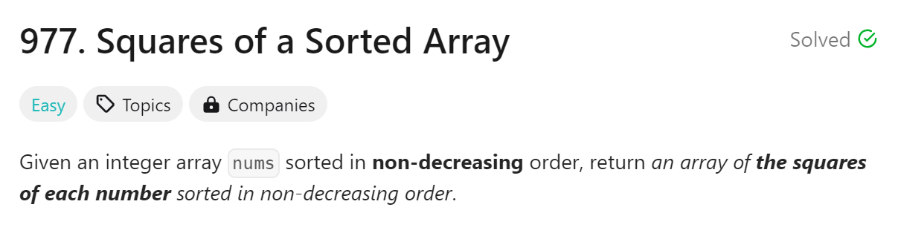
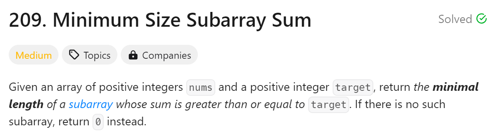
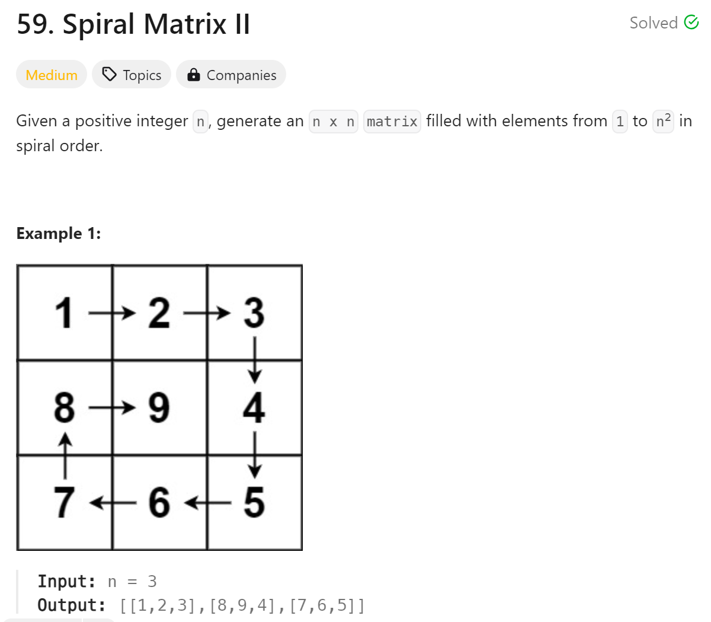

# day2

## 今日问题



两种解法：暴力遍历排序解法和双指针解法

解题难点：

1. 双指针解法的原理
2. 双指针解法时结果表格的建立

代码：

```python
#时间复杂度：O(n)
class Solution:
    def sortedSquares(self, nums: List[int]) -> List[int]:
        l, r, i = 0, len(nums)-1, len(nums)-1
        res = [float('inf')] * len(nums)
        while l <= r:
            if nums[l] ** 2 < nums[r] ** 2:
                res[i] = nums[r] ** 2
                r -= 1 
            else:
                res[i] = nums[l] ** 2
                l += 1 
            i -= 1 
        return res
```

```python
#时间复杂度：O(nlog(n))
class Solution:
    def sortedSquares(self, nums: List[int]) -> List[int]:
        nums2= []
        for num in nums:
            nums2.append(num**2)
        return sorted(nums2)
```

总结：

1. 快慢指针法很神奇，因为给定数列是有序的，所以平方完后的最大值只有可能出现在两端而不是中间，所以就可以用到快慢指针法
2. 暴力解法我还是可以写出来的hhh
3. 我觉得指针的用法很奇妙，我希望在休息日在好好琢磨一番

---



解题方法：暴力双循环解法，滑动窗口

解体难点：

1. 滑动窗口！！！不过本质好像就是双指针但是如果解不好就跟双循环没区别了

代码：

```python
#时间复杂度：O(n)
class Solution:
    def minSubArrayLen(self, s: int, nums: List[int]) -> int:
        l = len(nums)
        left = 0
        right = 0
        min_len = float('inf')
        cur_sum = 0 
        
        while right < l:
            cur_sum += nums[right]
            
            while cur_sum >= s: 
                min_len = min(min_len, right - left + 1)
                cur_sum -= nums[left]
                left += 1
            
            right += 1
        
        return min_len if min_len != float('inf') else 0
```

总结：

1. 我感觉现在跟指针有关的我都无法自己解出来，不过看答案还可以理解，复现都有点困难，打算周末自己在琢磨琢磨

---



解题方法：固定边界模拟循环

解题难点：如果不确定好边界和假设会绕进去

代码：

```python
#时间复杂度O(n^2)
class Solution:
    def generateMatrix(self, n: int) -> List[List[int]]:
        nums = [[0] * n for _ in range(n)]
        startx, starty = 0, 0              
        loop, mid = n // 2, n // 2          
        count = 1                           

        for offset in range(1, loop + 1) :   
            for i in range(starty, n - offset) :    
                nums[startx][i] = count
                count += 1
            for i in range(startx, n - offset) :   
                nums[i][n - offset] = count
                count += 1
            for i in range(n - offset, starty, -1) :
                nums[n - offset][i] = count
                count += 1
            for i in range(n - offset, startx, -1) : 
                nums[i][starty] = count
                count += 1                
            startx += 1       
            starty += 1

        if n % 2 != 0 :			
            nums[mid][mid] = count 
        return nums
```

总结：

1. 思路大概懂了,但是其他的一点都没懂，只能周日好好研究了，多做点笔记那会，这两天的都没有做笔记
