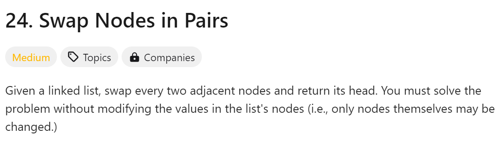
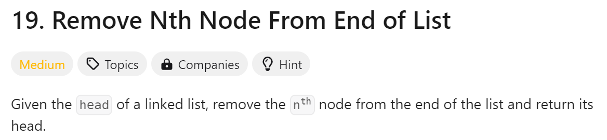
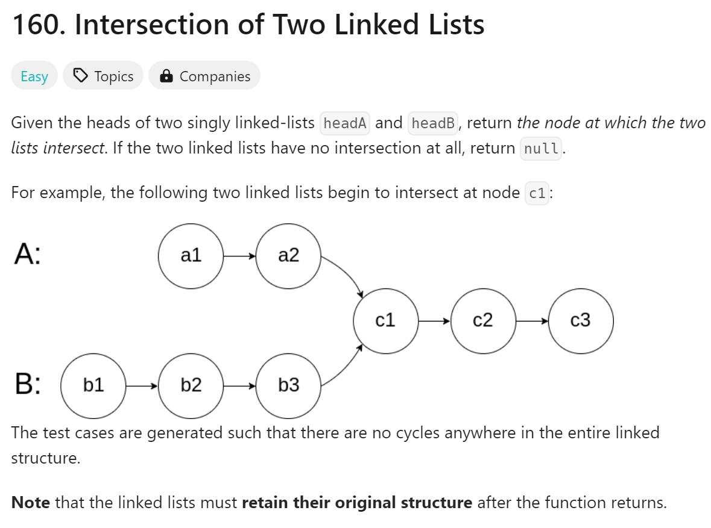
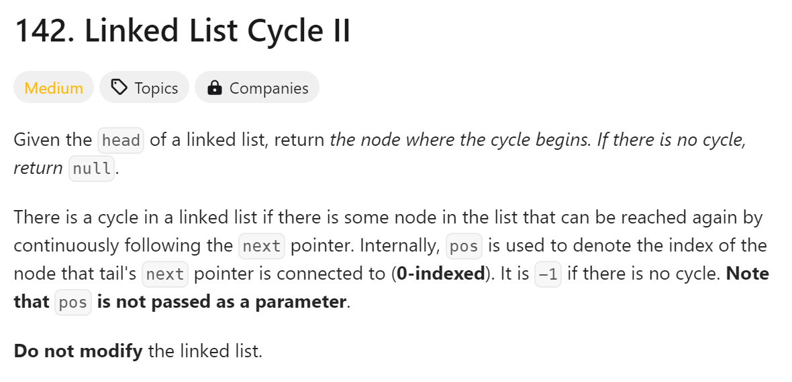

# day4

# 今日题目



解题方法：先断链接，链接新的，交换节点

解题难点：

1. 搞清楚的新的链接

代码：

```python
#时间复杂度：O(n)
# Definition for singly-linked list.
# class ListNode:
#     def __init__(self, val=0, next=None):
#         self.val = val
#         self.next = next
class Solution:
    def swapPairs(self, head: Optional[ListNode]) -> Optional[ListNode]:
        DummyHead = ListNode(next = head)
        current = DummyHead
        while current.next != None and current.next.next != None:
            node1 = current.next
            node2 = current.next.next
            node1.next = node2.next
            node2.next = node1
            current.next = node2
            current = node1
            
        return DummyHead.next
```

总结：

1. 第一遍做忘记了链接新的那步
2. 借助gpt可以自己写出来，比昨天快，大概是因为都是链表相关的



解题思路：确定要移除节点的正序索引，删除节点就好（跟昨天203一样）

解题难点：

1. 如何将倒序索引变成正序索引

```python
#时间复杂度：O(n)
# Definition for singly-linked list.
# class ListNode:
#     def __init__(self, val=0, next=None):
#         self.val = val
#         self.next = next
class Solution:
    def removeNthFromEnd(self, head: Optional[ListNode], n: int) -> Optional[ListNode]:
        current = head
        prev = None
        size = 0
        while current != None:
            current = current.next
            size += 1
        index = size - n    
        if index == 0:
            return head.next
        current = head
        for i in range(index-1):
            current = current.next
        current.next = current.next.next
        return head
```

总结：

1. 搞清楚索引问题就不难，这题也没花多久
2. 但是有快慢指针的方法我没有想到，后面补上



解题思路：确定链表长度，删除链表长度差值，使两个链表长度一样，找一样的节点

解题难点：

1. 这道题目想清楚了好像就没有难点了，但是得想到让两个链表长度一样

```python
#时间复杂度：O(n)
# Definition for singly-linked list.
# class ListNode:
#     def __init__(self, x):
#         self.val = x
#         self.next = None

class Solution:
    def getIntersectionNode(self, headA: ListNode, headB: ListNode) -> Optional[ListNode]:
        current = headA
        sizeA = 0
        while current != None:
            current = current.next
            sizeA += 1
        current = headB
        sizeB = 0
        while current != None:
            current = current.next
            sizeB += 1
        diff = abs(sizeA - sizeB)
        if sizeA > sizeB:
            for i in range(diff):
                headA = headA.next
        else:
            for i in range(diff):
                headB = headB.next
        while headA != headB:
            headA = headA.next
            headB = headB.next
        return headA
```

总结：

1. 虽然思路不是我想的，但是代码自己写出来的



解题思路：确认有没有环，再确认环的初始位置

解题难点：

1. 想到思路就挺难的，反正我没有想到

```python
#时间复杂度:O(n)
#Definition for singly-linked list.
# class ListNode:
#     def __init__(self, x):
#         self.val = x
#         self.next = None

class Solution:
    def detectCycle(self, head: Optional[ListNode]) -> Optional[ListNode]:
        slow = head
        fast = head
        while fast and fast.next:
            slow = slow.next
            fast = fast.next.next
            if slow == fast:
                break
        if not fast or not fast.next:
            return None
        slow = head
        while slow!= fast:
            slow = slow.next
            fast = fast.next
        return slow
```

总结：

1. 这道题目代码总体不难（毕竟也写了那么多链表题目了），但是在while的判断上我没想到
