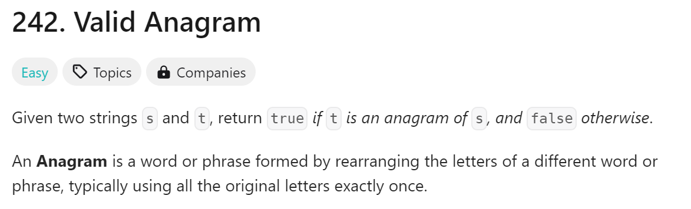
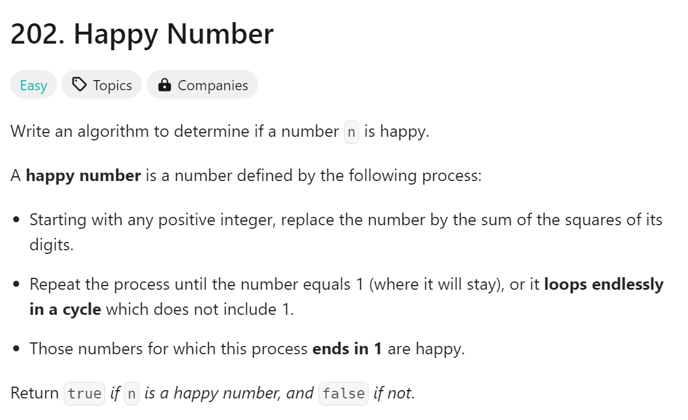
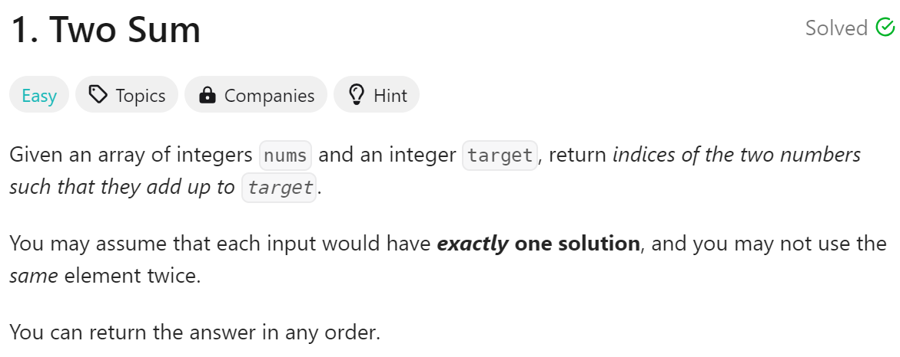

# day6

# 今日问题



解题思路：利用哈希表（字典），遍历然后将每一个字母出现的次数保存起来

解题难点：

1. 这题没有什么难度，稍微优化了一下算法

```python
#时间复杂度:O(n)
class Solution:
    def isAnagram(self, s: str, t: str) -> bool:
        dicts = {}
        for chr in s:
            if chr in dicts:
                dicts[chr] +=1 
            else:
                dicts[chr] = 1
        for chr in t:
            if chr in dicts:
                dicts[chr] -=1
            else:
                dicts[chr] = 1
        return all(value == 0 for value in dicts.values())
```

```python
#时间复杂度:O(n)
class Solution:
    def isAnagram(self, s: str, t: str) -> bool:
        record = [0] * 26
        for i in s:
            record[ord(i) - ord("a")] += 1
        for i in t:
            record[ord(i) - ord("a")] -= 1
        for i in range(26):
            if record[i] != 0:
                return False
        return True
```

总结：

1. 不难，一个字典的解法稍微想了一会


解题思路：找到相同的就可以了

解题难点：

1. 无

```python
#时间复杂度:O(n+m)
class Solution:
    def intersection(self, nums1: List[int], nums2: List[int]) -> List[int]:
        nums1_set = set(nums1)
        intersection = set()
        for num in nums2:
            if num in nums1_set:
                intersection.add(num)
        return list(intersection)
```

```python
#时间复杂度:O(n*m)
class Solution:
    def intersection(self, nums1: List[int], nums2: List[int]) -> List[int]:
        result = []
        for chr1 in nums1:
            for chr2 in nums2:
                if chr1 == chr2:
                    result.append(chr1)
        return set(result)
```



解题思路：循环直到n=1或者有重复就退出循环

解题难点：

1. 运用到哈希表的部分不难，但是算位数平方挺烦的

```python

#时间复杂度:O(log(n))
class Solution:
    def isHappy(self, n: int) -> bool:
        def getSumOfSquares(num):
            sum_of_squares = 0
            while num > 0:
                digit = num % 10
                sum_of_squares += digit ** 2
                num //= 10
            return sum_of_squares   
        seen = set()
        while n not in seen:
            if n == 1:
                return True
            seen.add(n)
            n = getSumOfSquares(n)
        return False

```

```python
#时间复杂度:O(log(n))
class Solution:
   def isHappy(self, n: int) -> bool:
       seen = []
       while n != 1:
           n = sum(int(i) ** 2 for i in str(n))
           if n in seen:
               return False
           seen.append(n)
       return True
```

总结：

1. 被循环弄烦了，代码随想录答案太养眼了



解题思路：循环加创建哈希表

解题难点：

1. 无

```python
class Solution:
    def twoSum(self, nums: List[int], target: int) -> List[int]:
        hashmap = {}
        for i in range(len(nums)):
            complement = target - nums[i]
            if complement in hashmap:
                return [i, hashmap[complement]]
            hashmap[nums[i]] = i
```

总结：

1. 今天的题目都不难，相比前两天
