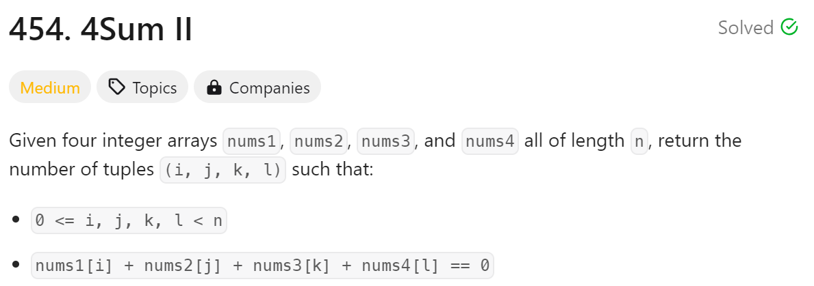
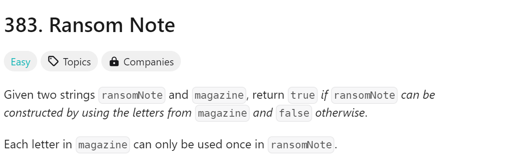
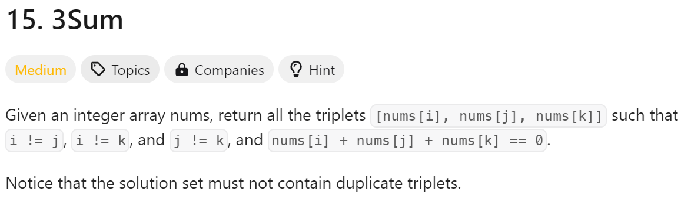
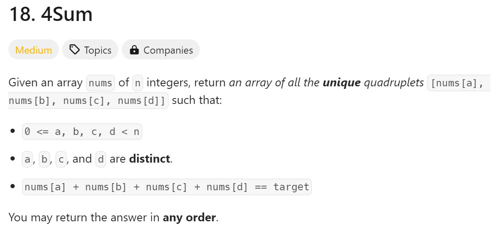

# day7

# 今日问题



解题思路：双循环

```python
#时间复杂度：O(n^2)
class Solution:
    def fourSumCount(self, nums1: List[int], nums2: List[int], nums3: List[int], nums4: List[int]) -> int:
        sum1 = {}
        result= 0
        for num1 in nums1:
            for num2 in nums2:
                if (num1 + num2) in sum1:
                    sum1[num1+num2] +=1 
                else:
                    sum1[num1+num2] = 1
        for num3 in nums3:
            for num4 in nums4:
                if -(num3 + num4) in sum1:
                    result += sum1[-(num3+num4)]
        return result
```

总结：

1. 在第二循环有点小问题



解题思路：双循环

```python
#时间复杂度:O(n+m)
class Solution:
    def canConstruct(self, ransomNote: str, magazine: str) -> bool:
        result = {}
        for char in ransomNote:
            if char in result:
                result[char] += 1
            else:
                result[char] = 1
        for char in magazine:
            if char in result:
               result[char] -= 1
               if result[char] == 0:
                   del result[char]
        return all(value == 0 for value in result.values())
```

总结：

1. 不难，但是一开始读题没有看清楚，细节问题



解题思路：双指针

```python
class Solution:
    def threeSum(self, nums: List[int]) -> List[List[int]]:
        result = []
        nums.sort()        
        for i in range(len(nums)):
            if nums[i] > 0:
                return result            
            if i > 0 and nums[i] == nums[i - 1]:
                continue               
            left = i + 1
            right = len(nums) - 1            
            while right > left:
                sum_ = nums[i] + nums[left] + nums[right]
                
                if sum_ < 0:
                    left += 1
                elif sum_ > 0:
                    right -= 1
                else:
                    result.append([nums[i], nums[left], nums[right]])
                    while right > left and nums[right] == nums[right - 1]:
                        right -= 1
                    while right > left and nums[left] == nums[left + 1]:
                        left += 1   
                    right -= 1
                    left += 1                   
        return result
```

总结：

1. 很多题目都没有想到可以用双指针
2. 避免重复要注意要不然很容易得不到想要的输出



解题思路：双指针

```python
class Solution:
    def fourSum(self, nums: List[int], target: int) -> List[List[int]]:
        nums.sort()
        n = len(nums)
        result = []
        for i in range(n):
            if nums[i] > target and nums[i] > 0 and target > 0:
                break
            if i > 0 and nums[i] == nums[i-1]:
                continue
            for j in range(i+1, n):
                if nums[i] + nums[j] > target and target > 0:
                    break
                if j > i+1 and nums[j] == nums[j-1]: 
                    continue
                left, right = j+1, n-1
                while left < right:
                    s = nums[i] + nums[j] + nums[left] + nums[right]
                    if s == target:
                        result.append([nums[i], nums[j], nums[left], nums[right]])
                        while left < right and nums[left] == nums[left+1]:
                            left += 1
                        while left < right and nums[right] == nums[right-1]:
                            right -= 1
                        left += 1
                        right -= 1
                    elif s < target:
                        left += 1
                    else:
                        right -= 1
        return result
```

总结：

1. 需要重点复习题目
