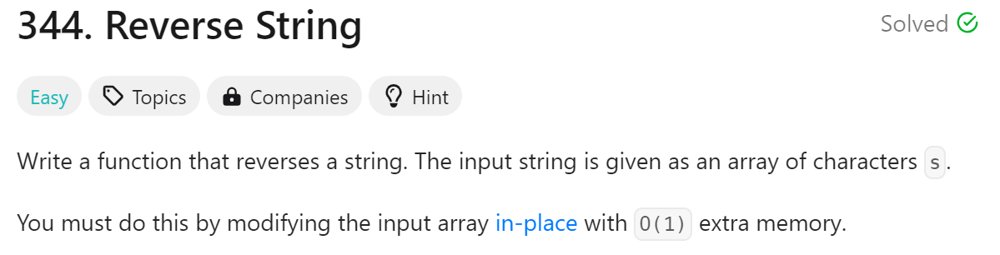
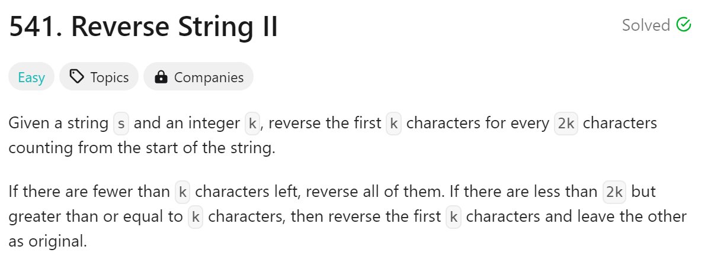
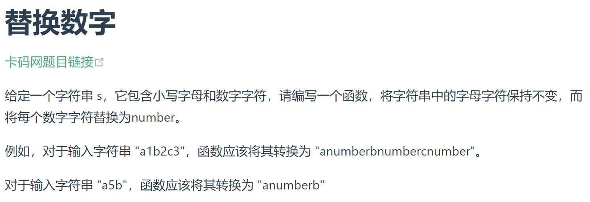
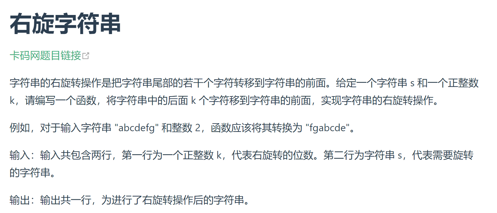

# day8

# 今日问题



解题思路：直接双指针

解题难点：

1. 无

```python
#时间复杂度:O(n)
class Solution:
    def reverseString(self, s: List[str]) -> None:
        start = 0
        end = len(s) - 1
        while end > start:
            s[start], s[end] = s[end], s[start]
            start += 1
            end -= 1
```

总结：

1. 太简单了，一上来有点不适应hhh

---



```python
#时间复杂度:O(n)
class Solution:
    def reverseStr(self, s: str, k: int) -> str:
        result = ""
        for i in range(0, len(s), 2*k):
            part1 = s[i:i+k][::-1]
            part2 = s[i+k:i+2*k]
            result += part1 + part2
        return result
```

---



解题思路：遍历判断是否为数字，然后返回到一个新的字符串

解题难点：

1. 无

```python
s = input()
result = ""
for i in range(len(s)):
    if not s[i].isdigit():
        result += s[i]
    else:
        result += "number"
print(result)
```

总结：

1. 因为不是在leetcode上，需要自己定义一下输入而且最后是print不是return有点不习惯

---


解题思路：切片然后双指针

解题难点：

1. 无

```python
class Solution:
    def reverseWords(self, s: str) -> str:
        words = s.split()
        start = 0
        end = len(words) - 1
        while end > start:
            words[start], words[end] = words[end], words[start]
            start += 1
            end -= 1
        return ' '.join(words)
```

总结：

1. 稍微有点忘记split的用法了，其余的都不难

---



解题思路：我感觉用切片就好

解题难点：

1. 无

```python
k = int(input())
s = input()
print(s[-k:] + s[:-k])
```

总结：

1. 太久没用切片了，忘记-k就是倒数到k的
