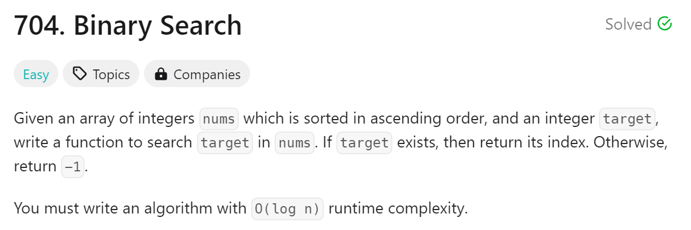
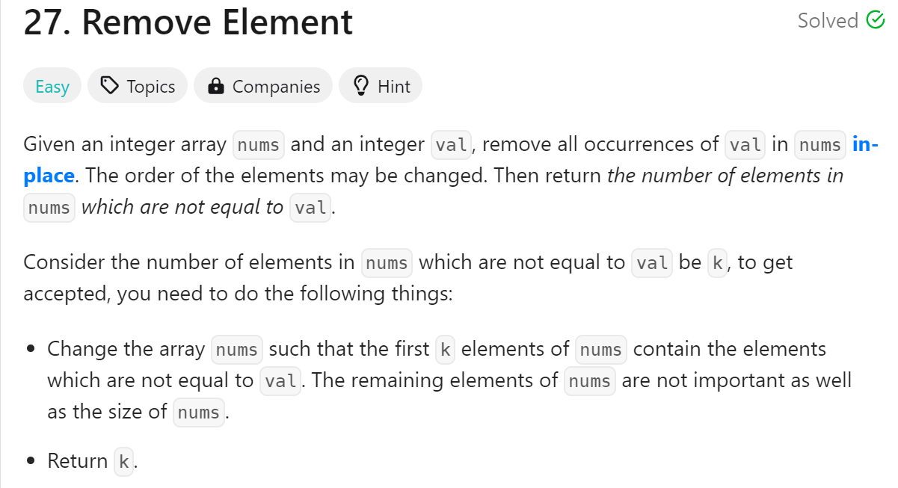

# day1



[https://leetcode.com/problems/binary-search/description/](https://leetcode.com/problems/binary-search/description/)

两种解法：左闭右闭和左闭右开

解题难点：

1. 定义区间时应该用<还是≤
2. 修改边界的时候是mid还是mid+1（mid-1）

代码：

```python
#时间复杂度：O(log2(n))
class Solution:
    def search(self, nums: List[int], target: int) -> int:
        left = 0
        right = len(nums) - 1
        while left <= right:
            mid = (left + right) // 2
            if target == nums[mid]:
                return mid
            elif target < nums[mid]:
                right = mid - 1 
            elif target > nums[mid]:
                left = mid + 1
        return -1
```

```python
#时间复杂度：O(log2(n))
class Solution:
    def search(self, nums: List[int], target: int) -> int:
        left = 0
        right = len(nums)
        while left < right:
            mid = (left + right) // 2
            if target == nums[mid]:
                return mid
            elif target < nums[mid]:
                right = mid 
            elif target > nums[mid]:
                left = mid + 1
        return -1
```

总结：

1. 如果分不清楚区间已经左，右边界的更新，我觉得画图很助于理解
2. 搭配视频，理解会更清楚
3. 一天刷两道leetcode非常有成就感
4. 还去了解了一下为什么binary search的时间复杂度是log（n），准确的来说是$log2(n)$

<aside>
💡 假设k是我们需要二分的次数，那 $n * (1/2)^k = 1$， 那k就等于$log2(n)$

</aside>

---




[https://leetcode.com/problems/remove-element/description/](https://leetcode.com/problems/remove-element/description/)

两种解法：双重循环暴力解法，快慢指针解法

解题难点：

1. 因为列表不能被删除，只能覆盖，所以需要用双循环来完成（一个侦测，一个覆盖）
2. 快慢指针难以理解（没有完全理解）

代码：

```python
#时间复杂度:O(n)
class Solution:
    def removeElement(self, nums: List[int], val: int) -> int:
        fast = 0  
        slow = 0  
        size = len(nums)
        while fast < size:  
            if nums[fast] != val:
                nums[slow] = nums[fast]
                slow += 1
            fast += 1
        return slow
```

```python
#时间复杂度:O(n^2)
class Solution:
    def removeElement(self, nums: List[int], val: int) -> int:
        i, l = 0, len(nums)
        while i < l:
            if nums[i] == val:
                for j in range(i+1, l):
                    nums[j - 1] = nums[j]
                i -= 1 
                l -= 1
            i += 1
        return l
```

总结：

1. 我觉得这道题目需要二刷，双重循环的解法我都不能自己写出来
2. 快慢指针的想法确实惊艳到了我
