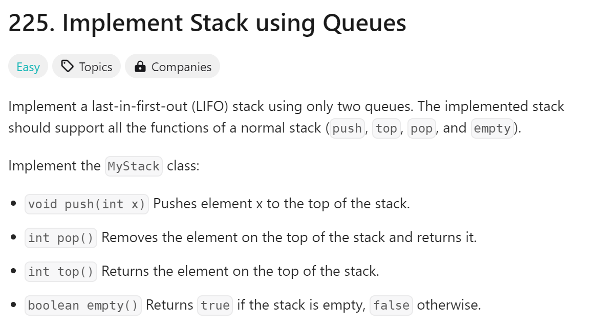
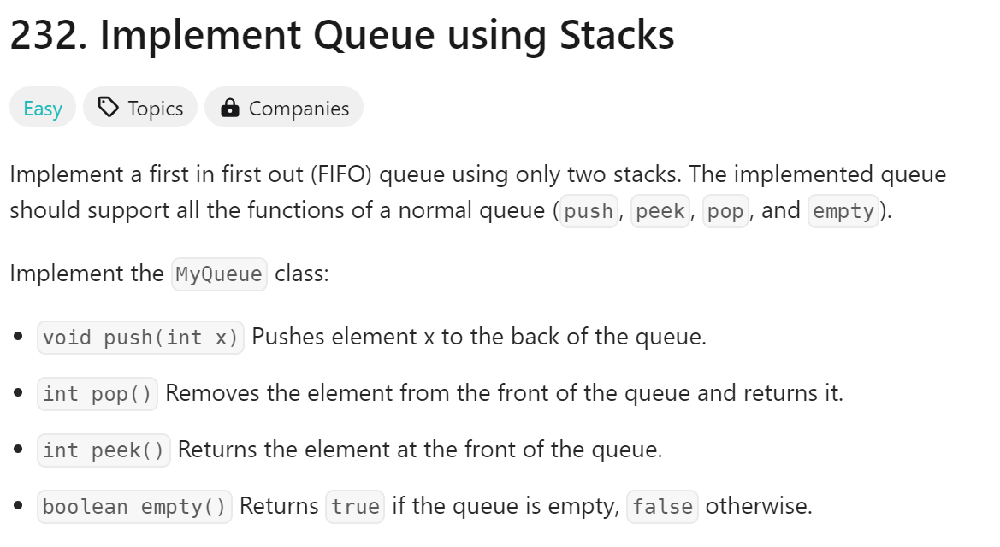

# day10

# 今日问题



解题思路：用双列表来实现FIFO栈

解题难点：

1. 理解FIFO栈的思想

```python
class MyQueue:

    def __init__(self):
        self.stack1 = []
        self.stack2 = []

    def push(self, x: int) -> None:
        self.stack1.append(x)

    def pop(self) -> int:
        if self.stack2 == []:
            while self.stack1 != []:
                element = self.stack1.pop()
                self.stack2.append(element)
        return self.stack2.pop()

    def peek(self) -> int:
        if self.stack2 == []:
            while self.stack1 != []:
                element = self.stack1.pop()
                self.stack2.append(element)
        return self.stack2[-1]

    def empty(self) -> bool:
        return self.stack1 == [] and self.stack2 == []
```

总结：

1. 代码难度不高，只是列表的一些基础用法
2. 但是写起来很困难，还没怎么理解stack

---



解题思路：跟上一题反过来

解题难点：

1. 如何运用两个stack以及他们之间的关系

```python
class MyQueue:

    def __init__(self):
        self.stack1 = []
        self.stack2 = []

    def push(self, x: int) -> None:
        self.stack1.append(x)

    def pop(self) -> int:
        if self.stack2 == []:
            while self.stack1 != []:
                element = self.stack1.pop()
                self.stack2.append(element)
        return self.stack2.pop()

    def peek(self) -> int:
        if self.stack2 == []:
            while self.stack1 != []:
                element = self.stack1.pop()
                self.stack2.append(element)
        return self.stack2[-1]

    def empty(self) -> bool:
        return self.stack1 == [] and self.stack2 == []
```

总结：

1. 绝对需要二刷的题目
