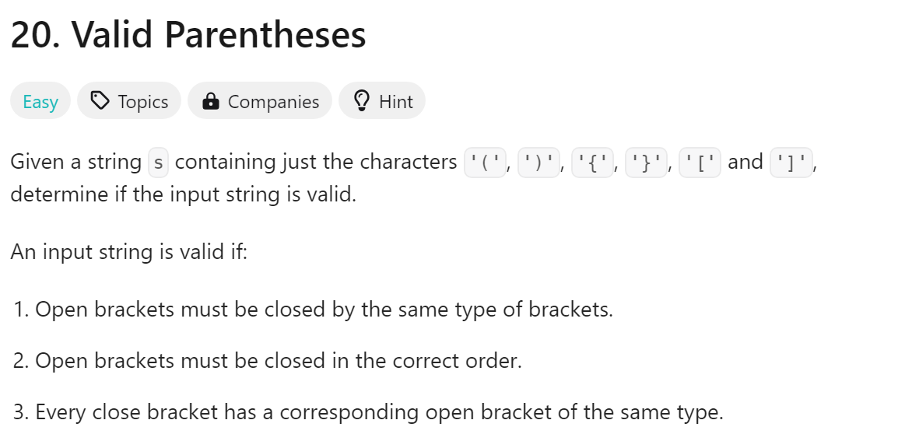
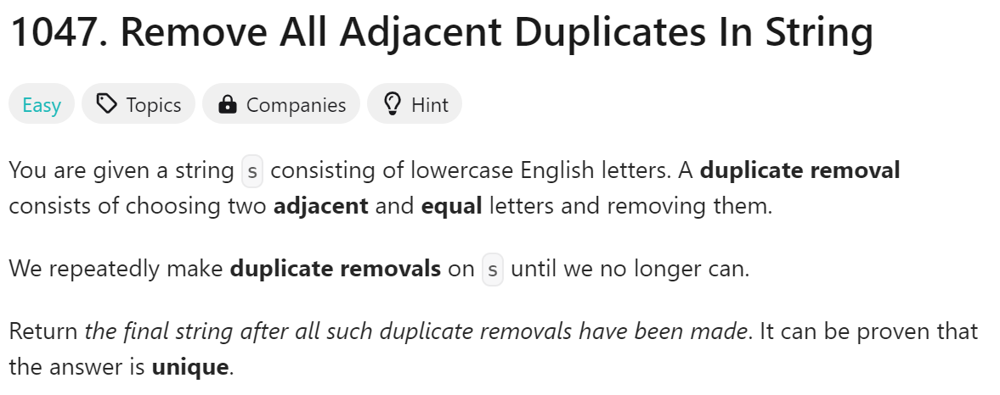
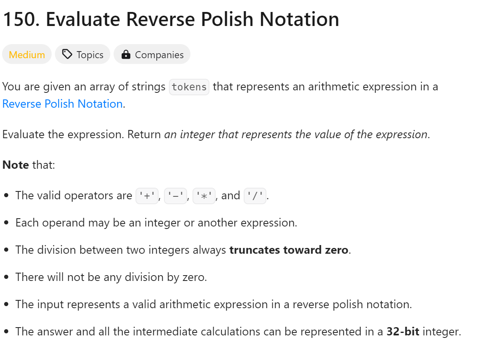

# day11

# 今日问题



解题思路：运用栈的特性去查看是否是完整括号

解题难点：

1. 感觉思路没那么难但是写代码就一堆问题

```python
class Solution:
    def isValid(self, s: str) -> bool:
        stack = []
        for item in s:
            if item == '(':
                stack.append(')')
            elif item == '[':
                stack.append(']')
            elif item == '{':
                stack.append('}')
            elif not stack or stack[-1] != item:
                return False
            else:
                stack.pop()
        return True if not stack else False
```

总结：

1. 在判定是否为完整括号需要多加练习

---



```python
class Solution:
    def removeDuplicates(self, s: str) -> str:
        stack = []
        for i in range(len(s)):
            if not stack:
                stack.append(s[i])
            elif s[i] == stack[-1]:
                stack.pop()
            else:
                stack.append(s[i])
        return ''.join(stack)
```

总结：
1. 需要二刷

---



解题思路：判定token进行对应的运算

解题难点：

1. 卡在/那里了，小小的数学问题

```python
class Solution:
    def evalRPN(self, tokens: List[str]) -> int:
        stack = []
        for token in tokens:
            if token in ['+', '-', '*', '/']:
                num2 = stack.pop()
                num1 = stack.pop()
                if token == '+':
                    stack.append(num1 + num2)
                elif token == '-':
                    stack.append(num1 - num2)
                elif token == '*':
                    stack.append(num1 * num2)
                elif token == '/':
                    result = int(float(num1) / num2)
                    stack.append(result)
            else:
                stack.append(int(token))
        return stack[0]

```

总结：

1. 这题不难，唯一不难的题目
