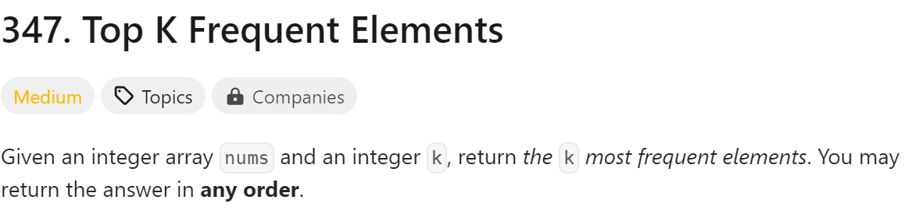

# day13

# 今日问题


解题思路：滑动窗口，虽然没明白

总结：

1. 这题直接放弃写代码了，因为还不知道deque是什么，大概理解了思路

---



解题思路：也是栈吧，但是我用字典做出来了

解题难点：

1. 在确定列表顺序那里用到了lambda

```python
class Solution:
    def topKFrequent(self, nums: List[int], k: int) -> List[int]:
        count = {}
        for num in nums:
            if num in count:
                count[num] += 1
            else:
                count[num] = 1
        num_freq = count.items()
        num_freq = sorted(num_freq, key=lambda x: x[1], reverse=True)
        top_k = [num for num, freq in num_freq[:k]]
        return top_k
```

总结：

1. 绝对需要复习的题目
