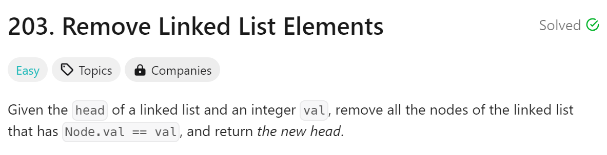
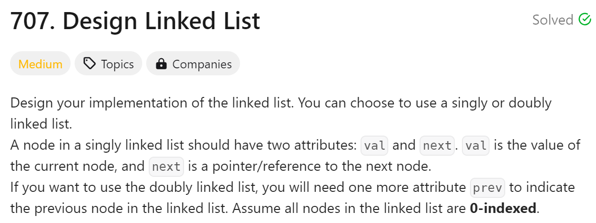
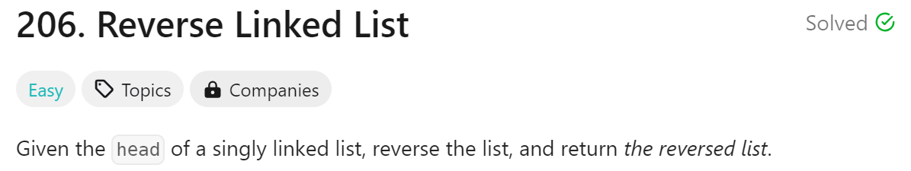

# day3

# 今日问题



解法：利用链表的特性创建prev和current双指针来一一对val进行判断

解体难点：

1. 理解链表本身，还有.next
2. 双指针的运用，条件判断

代码：

```python
#时间复杂度：O(n)
# Definition for singly-linked list.
# class ListNode:
#     def __init__(self, val=0, next=None):
#         self.val = val
#         self.next = next
class Solution:
    def removeElements(self, head: Optional[ListNode], val: int) -> Optional[ListNode]:
        if head == None:
            return None
        while head != None and head.val == val:
            head = head.next
        current = head
        prev = None
        while current != None:
            if current.val != val:
                prev = current
                current = current.next
            elif current.val == val and prev != None:
                prev.next= current.next
                current = current.next
            elif current.val == val and prev == None:
                head = current.next
        return head
```

总结：

1. 今天运用了gpt4的khan tutor终于手写出了代码感觉很爽
2. 链表的定义有点复杂还需要一点时间慢慢理解，尤其是next
3. 不过了解到链表相比数组的优势那部分很感兴趣

---



解法：一个一个利用链表的特点和指针慢慢解…

解题难点：

1. 这道题目虽然算medium但是原理不太难（跟206相比），在做完第一道题目

代码：

```python
#时间复杂度:O(n)
class LinkNode:
    def __init__(self, val=0, next=None):
        self.val = val
        self.next = next

class MyLinkedList:

    def __init__(self):
        self.head = None
        self.size = 0

    def get(self, index: int) -> int:
        if index < 0 or index >= self.size:
            return -1
        current = self.head
        for i in range(index):
            current = current.next
        return current.val

    def addAtHead(self, val: int) -> None:
        newnode = LinkNode(val, self.head)
        self.head = newnode 
        self.size += 1

    def addAtTail(self, val: int) -> None:
        if self.head == None:
            newnode = LinkNode(val, self.head)
            self.head = newnode
            self.size += 1
        else:
            current = self.head
            while current.next != None:
                current = current.next
            newnode = LinkNode(val, None)
            current.next = newnode
            self.size += 1

    def addAtIndex(self, index: int, val: int) -> None:
        if index == self.size:
            self.addAtTail(val)
        elif 0 < index < self.size:
            current = self.head
            for i in range(index - 1):
                current = current.next
            newnode = LinkNode(val, current.next)
            current.next = newnode
            self.size += 1
        elif index == 0:
            self.addAtHead(val)
            
    def deleteAtIndex(self, index: int) -> None:
        if 0 < index < self.size:
            current = self.head
            prev = None
            for i in range(index):
                prev = current
                current = current.next
            prev.next = current.next
            self.size -= 1
        elif index == 0:
            self.head = self.head.next
            self.size -= 1

```

总结：

1. 这道题目真的好有意思，而且涵盖了好多知识点特别适合拿来复习hh

---



解法：这道题目的解法我是跟着gpt来的，没想通，周日在想想

解题难点：

1. 想不到怎么reverse，也不理解gpt给的方法

代码：

```python
#时间复杂度：O(n)
# Definition for singly-linked list.
# class ListNode:
#     def __init__(self, val=0, next=None):
#         self.val = val
#         self.next = next
class Solution:
    def reverseList(self, head: Optional[ListNode]) -> Optional[ListNode]:
        prev = None
        current = head
        while current != None:
            next = current.next
            current.next = prev
            prev = current
            current = next
        return prev
```

总结：

1. 一道特别需要复习重新思考的题目！！！
